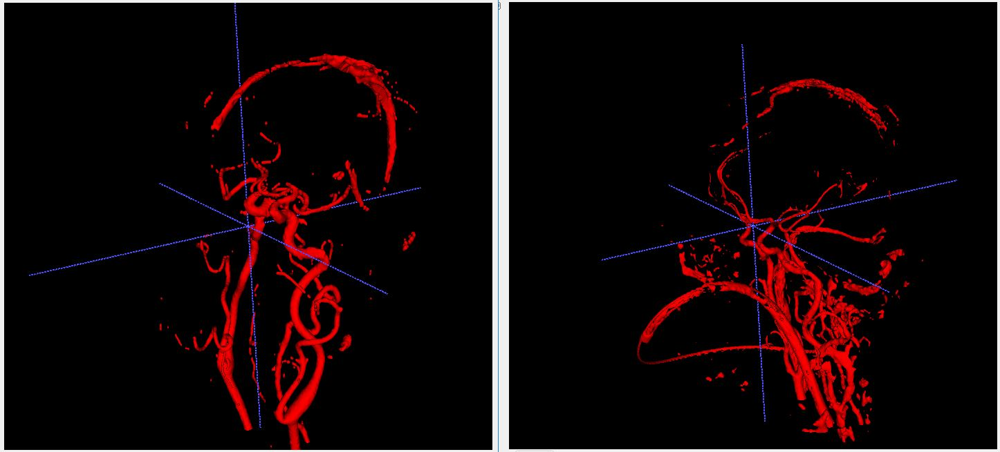
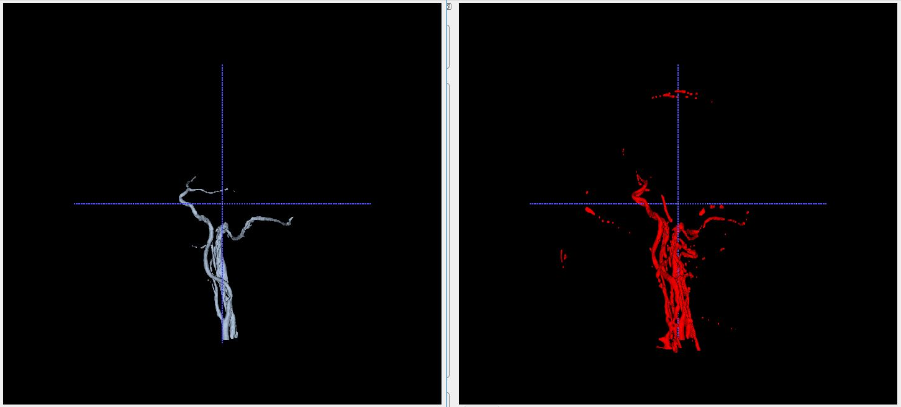
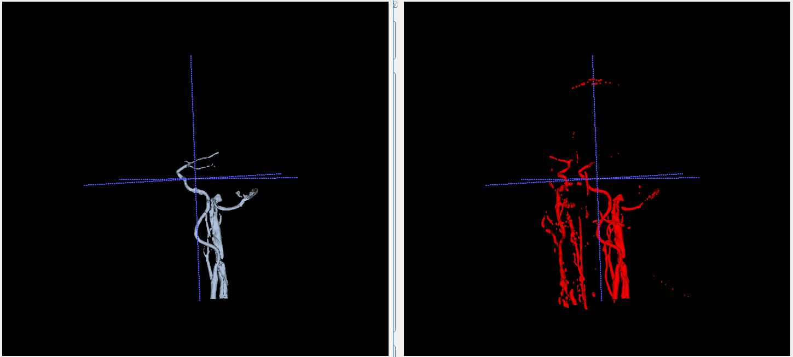
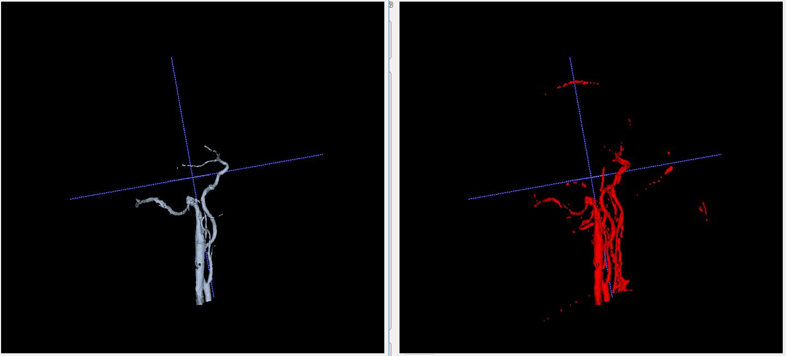
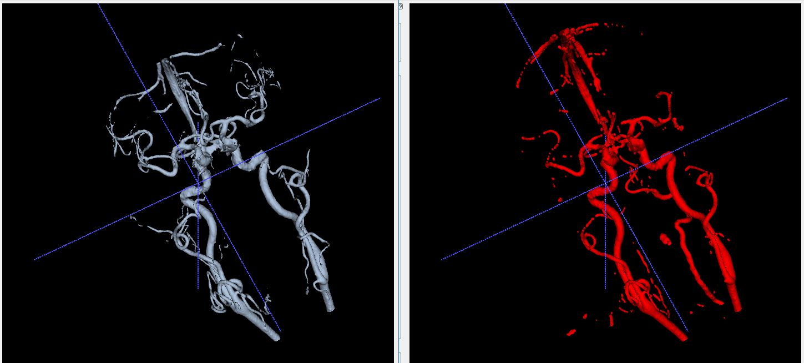
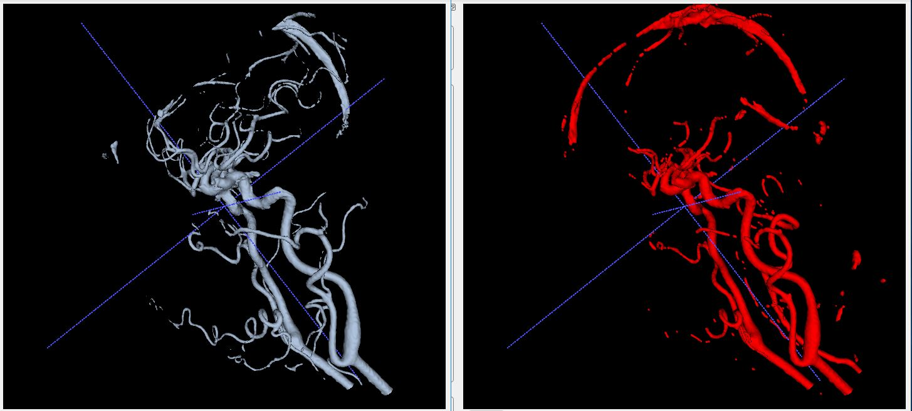
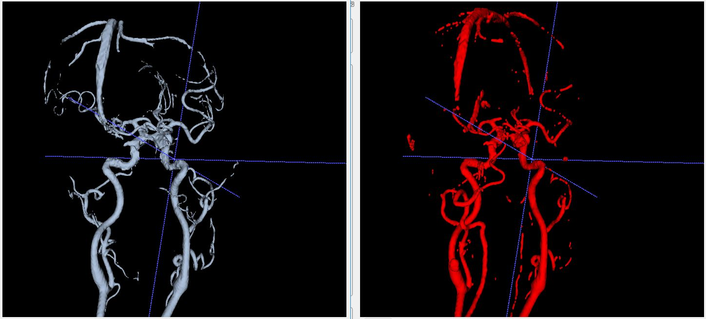

## 数据
1. 以下算法都是在 ***剪影数据*** 上实现的；
## 粗分割算法
1. 方法：二值阈值化+腐蚀+膨胀算法
2. 采用itk的filter: `BinaryThresholdImageFilter`,`BinaryErodeImageFilter`,`BinaryDilateImageFilter`
3. 参数：
   1. `BinaryThresholdImageFilter`， 采用窗宽窗位作为阈值， 经调试，比较好的阈值如下：`int16_t lowerThreshold = 180; int16_t upperThreshold = 2000;`
   2. `BinaryErodeImageFilter`,`BinaryDilateImageFilter`, 目前采用：`structuringElement.SetRadius(1);`
4. 是否要加腐蚀膨胀操作
   1. 若不加腐蚀膨胀操作，在骨头附近会有大量噪点；
   2. 如果加了腐蚀膨胀操作， 细小的血管会被腐蚀掉
   3. 对比图如下，左图为腐蚀膨胀图，右图为未经腐蚀膨胀的图像：


## 区域增长算法
以下区域增长算法，都是基于单一种子点的实现

### 1. ConnectedThresholdImageFilter
1. 参数：与粗分割阈值相同
2. 效果如下，左图为单点区域增长，右图为粗分割效果：

数据0:




数据1:




### 2. NeighborhoodConnectedImageFilter

1. 参数
   1. 阈值与粗分割相同
   2. 邻域范围,分别设置了1-10，不同的搭配值
    ```
    radius[0] = 1;
	radius[1] = 1;
	radius[2] = 1;
    ```
2. 效果，无法得到mask


### 

## reference
