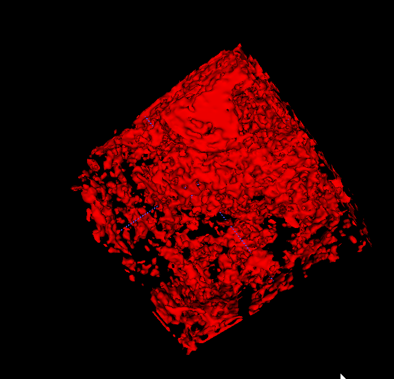

## 记录调试分割算法过程

---
|试验编号|命令|数据|参数|loss|结果记录|分析原因及调整|备注|试验日期|
|-|-|-|-|-|-|-|-|-|
|-|tube_seg/task/train_neuro_vascular_seg_unet3d_20200317.sh|数据22例，体数据[0-1],mask:[0/1]|crop:[224,224,56]|BCE loss|无法分割出任何结果|mask中，0/1数据比例太大，不均衡，考虑focal loss|-|20200317|
|-|tube_seg/task/train_neuro_vascular_seg_unet3d_20200317.sh|数据22例，体数据[0-1],mask:[0/1]|crop:[224,224,56]|focal loss|结果嘈杂无章，见：|检查一下训练过程中是否能正确分割|-|20200317|
---
